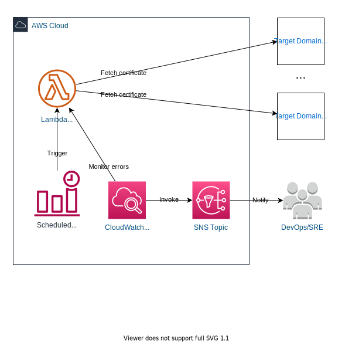

# SSL certificate checker CDK

This repository contains a CDK application defining a scheduled AWS Lambda function that checks whether the SSL certificates of a set of domains are expired or about to expire. If any of the certificates are expired or near expiration, the function fails, triggering a CloudWatch alarm which sends an email using SNS.

## Environment settings

The following environment settings are defined in the cdk.json file:

* `domains`: a comma separated list defining the domains to check
* `email`: the email address that receives the notification in case of issues with the certificate
* `enableAlerts`: a flag enabling or disabling the alerts

## Useful commands

* `cdk bootstrap` initializes the CDK toolkit stack. This command has to be executed only once per environment.
* `cdk synth -c [ENV]` synthesizes the CDK stack into a CloudFormation template which is printed to the console
* `cdk deploy -c [ENV]` deploys the CDK stack to the desired environment. If no parameter is provided it deploys to the development environment.
* `cdk destroy -c [ENV]` destroys the CDK stack from the desired environment. If no parameter is provided it deploys to the development environment.
* `start.bat` executes the Lambda handler